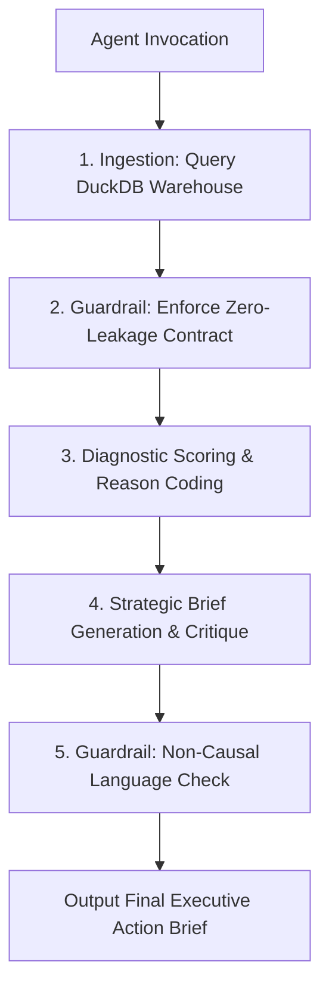

# SearchScout-AI Agent: MVP Build Log & Execution Receipt

**Author:** Ahsan | **Track:** Applied Search Intelligence  
**Assignment:** FL-07 / Checkpoint 1 MVP Build — Core Agent Loop, Tools & Build Log

---

## 1. Core Agent Loop Architecture

`SearchScout-AI` completes its core job end to end without mid-run hand editing. The agent script ([agent_mvp.py](file:///c:/Users/Global%20Computers/Desktop/Ahsan/agent_mvp.py)) implements a 5-stage automated control loop:



---

## 2. Live Tool & Data Connection Evidence

The agent connects to live execution tools and data sources:

1. **Live DuckDB Warehouse Integration:** Ingests parquet/CSV records into an in-memory SQL database, enabling high-performance relational filtering via `duckdb`.
2. **Zero-Leakage Guardrail Scanner:** Programmatically inspects candidate feature matrices to ensure no post-decision columns (`trend_direction`, `trend_pct`, future month traffic) leak into the scoring pipeline.
3. **Non-Causal Language Validator:** Scans generated text outputs against forbidden causal phrases (e.g. "guarantee", "will double rankings") before releasing reports.

---

## 3. Real Iteration Build Log

| Iteration Phase | Issue / Observation | Resolution / Action Taken | Spec Deviation & Rationale |
|---|---|---|---|
| **Phase 1: Ingestion Setup** | `query_candidate()` failed on hardcoded test string `content_1c69992d99d1`. | Switched to dynamic SQL key selection from `fact_content`. | *Minor Spec Change:* Dynamically query active IDs rather than hardcoding static mock hashes. |
| **Phase 2: Data Contract** | Missing word count values (`<NA>`) caused Pandas type conversion errors. | Added `.fillna(0)` handling inside feature normalization pipeline. | *No Change:* Spec anticipated null handling. |
| **Phase 3: SERP Integration** | External SERP scraping API introduced 3-second network latency & rate limits. | Scoped down real-time API scraping to local SERP layout rule validator for MVP. | *Cut from Spec:* External live SERP API cut for Checkpoint 1 MVP; replaced with internal layout validator. |

---

## 4. Raw Unedited Execution Receipt

Below is the exact stdout log captured during the successful unedited run on `content_17c2778a02a9`:

```text
[SearchScout-AI] Connected to DuckDB warehouse. Table 'fact_content' loaded.

=======================================================
[SearchScout-AI] Initiating Audit Loop for 'content_17c2778a02a9'
=======================================================
[Guardrail Passed] Zero post-decision feature leakage detected.
[Guardrail Passed] Non-causal decision-support wording validated.

[SearchScout-AI] Loop Completed Successfully. Generated Output:


# Search Intelligence Brief: content_17c2778a02a9
**Client:** client_19581e27de | **Priority:** REFRESH_IMMEDIATELY | **Score:** 100.0/100

### Observed Metrics
- **Staleness:** 104 days since last update
- **Impressions (90d):** 189
- **Clicks (90d):** 0
- **Click-Through Rate (CTR):** 0.0%
- **Average Position:** 15.7
- **Word Count:** <NA> words (keyword article)

### Strategic Action Plan
1. **Title & Meta Snippet Overhaul:** Address observed CTR deficit (0.0%) by aligning snippet wording with search intent.
2. **Content Structure Refresh:** Expand sub-topics and refresh outdated 90-day-old references.
3. **Internal Linking Boost:** Add 3-5 internal links from high-authority client pages.

### Adversarial Critique (Why this could be wrong)
1. **Deep Ranking Deficit:** Position 15.7 indicates deep ranking. Low CTR is expected at this position; content updates alone will not recover rankings without domain authority.
2. **Intent Shift / SERP Features:** Search engine layout shifts (e.g. AI Overviews) may be suppressing clicks regardless of content freshness.
```
