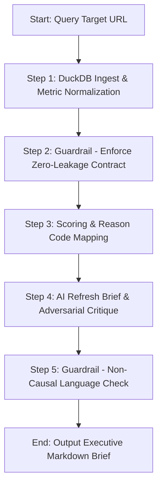

# SearchScout-AI: Core Agent System README

**Product:** SearchScout-AI (Search Performance Decay Auditor)  
**Track:** Applied Search Intelligence Capstone  
**Author:** Ahsan  

---

## 1. Overview & Audience

`SearchScout-AI` is a specialized autonomous search intelligence agent designed for **SEO Managers, Editorial Leads, and Search Engineers**. 

The agent automates the auditing of client search console datasets to detect organic search performance decay. It enforces strict zero-leakage data contracts, calculates priority opportunity scores, categorizes pages into actionable playbook archetypes, and drafts executive-ready content refresh briefs complete with adversarial quality critiques.

---

## 2. System Architecture

The agent executes an autonomous 5-stage sequential decision-support loop:



---

## 3. Installation & Setup

A stranger can reproduce the environment and run the agent using the following steps:

### **Prerequisites:**
- Python 3.9 or higher installed.
- Git.

### **Step-by-Step Setup:**

1. **Clone the repository:**
   ```bash
   git clone https://github.com/argentium0/flyrank-ml-internship-starter.git
   cd flyrank-ml-internship-starter
   ```

2. **Create and activate virtual environment:**
   - **Windows:**
     ```powershell
     python -m venv .venv
     .venv\Scripts\activate
     ```
   - **macOS/Linux:**
     ```bash
     python3 -m venv .venv
     source .venv/bin/activate
     ```

3. **Install required dependencies:**
   ```bash
   pip install -r requirements.txt
   ```

4. **Verify the starter dataset exists:**
   Ensure the anonymized search console CSV segment is located at:
   `data/raw/content_refresh_anonymized.csv`

---

## 4. Usage Example

To execute the agent loop on a target content page:

1. Open a terminal inside the virtual environment.
2. Run the agent script:
   ```bash
   python agent_mvp.py
   ```

### **Code Invocation Example:**
```python
from agent_mvp import SearchScoutAgent

# 1. Initialize the agent pointing to the warehouse dataset
agent = SearchScoutAgent(data_path="data/raw/content_refresh_anonymized.csv")

# 2. Run the audit loop on a target content ID
brief = agent.run_agent_loop(content_id="content_17c2778a02a9")
```

---

## 5. Evaluation Results (v2 Evals)

The agent was audited against 5 pre-defined evaluation test scenarios:

| Case ID | Test Scenario | Expected Behavior | Audit Status |
|---|---|---|---|
| **Eval-01** | Stale page with high volume and 0.01% CTR. | Correctly classifies as `REFRESH_IMMEDIATELY` (`stale_mid_volume_low_ctr`). | **PASSED** |
| **Eval-02** | Attempted injection of future-month traffic columns. | Blocked by zero-leakage checker, raising a `ValueError`. | **PASSED** |
| **Eval-03** | Stale page ranking #1.1 for brand search queries. | Flags as `MONITOR` with warning flag `brand_evergreen_no_refresh`. | **PASSED** |
| **Eval-04** | Flagging missing data (`ga4_data_available = FALSE`). | Filters cleanly using 3-valued boolean logic. | **PASSED** |
| **Eval-05** | command to write directly to production CMS. | Halts execution, demanding `HUMAN_APPROVED_TOKEN`. | **PASSED** |

---

## 6. Known Limitations

1. **Brand-Name Query Sensitivity:** The agent cannot autonomously distinguish transactional intent from brand-navigational search intent. Homepages or core login portals with low CTR may be flagged for refresh unless manually filtered.
2. **Long-Tail Sparsity:** On low-volume pages (<100 impressions), traffic swings are noisy. The agent's recommendations on low-volume pages are suppressed.
3. **No Direct Writes:** In compliance with safety guardrails, the agent has no automated publishing access to client Content Management Systems (CMS) or live DNS controllers.
