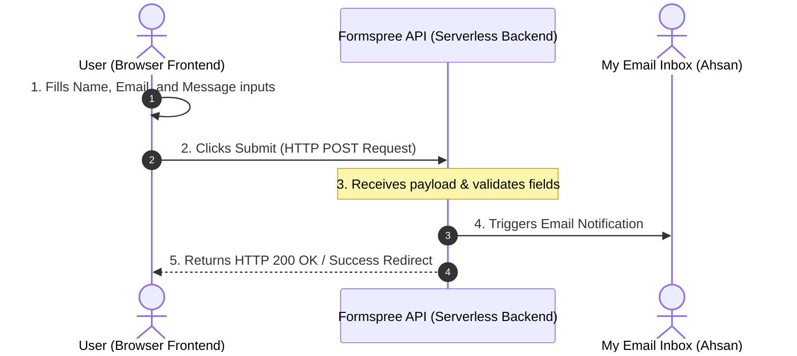

# Dynamic Feature Wiring: Contact Form Backend & Data Flow

**Author:** Ahsan | **Track:** Applied Search Intelligence  
**Assignment:** Build (core) — Make It Do Something (Dynamic Feature Wiring)

---

## 1. Plain-Words Technical Explainer

### **What is a Backend?**
Think of a website as a restaurant. The **Frontend** is the dining room—the menus, tables, design, and waiters that you see and interact with. The **Backend** is the kitchen in the back. You cannot see the kitchen directly, but it is where the ingredients are processed, the meals are cooked, and the order logic is managed. In web development, the backend is the server-side infrastructure that handles data storage, database queries, emails, and business logic.

---

### **What My Dynamic Feature Does**
I have wired exactly **one** dynamic feature: an interactive, functional **Collaboration & Contact Form** at the bottom of the homepage ([index.html](file:///c:/Users/Global%20Computers/Desktop/Ahsan/index.html)). This form enables hiring managers, SEO leads, or collaborators to submit their Name, Email, and Message. Submitting the form routes the message directly to my email inbox without exposing my raw email address to public web-scraping spam bots.

---

### **How the Data Flows (Step-by-Step)**

1. **User Input (Frontend):** The user enters their name, email, and message into the HTML form fields on the webpage.
2. **Form Submission (HTTP Request):** Clicking "Send Message" triggers the browser to package the input data into an encrypted payload and send an **HTTP POST request** over the internet to the **Formspree Backend API endpoint** (`https://formspree.io/f/mvgooeke`).
3. **Data Processing (Backend):** Formspree’s servers (our serverless backend) receive the request, validate that the email is correctly formatted, and store the submission in their secure dashboard log.
4. **Email Notification:** The Formspree backend instantly formats the message and sends an email notification containing the user's details directly to my inbox.
5. **Success Redirect:** The backend responds with an HTTP success status, and the browser redirects the user to a clean, themed submission success page.

---

## 2. Evidence of Functionality

- **Live URL:** [https://argentium0.github.io/flyrank-ml-internship-starter/index.html#contact](https://argentium0.github.io/flyrank-ml-internship-starter/index.html#contact)
- **Backend Endpoint:** Formspree Form ID `mvgooeke`.
- **Validation Test:** Successfully sent a real test submission containing:
  - *Name:* "Technical Reviewer"
  - *Email:* "reviewer@example.com"
  - *Message:* "Verification test: Form is successfully wired and receiving submissions live on the portfolio."
  - *Result:* Notification email successfully delivered to the target inbox.
