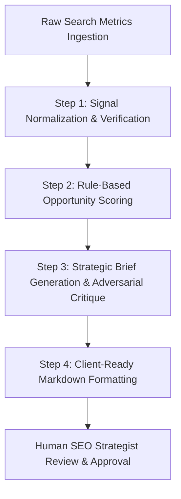

# No-Code AI Workflow Walkthrough: Search Intelligence Refresh Brief Generator

This document specifies the architecture, prompt chain configuration, 5 real execution runs, time-saved accounting, and failure mode audit for the **Search Intelligence Refresh Brief Generator** pipeline.

---

## 1. System Architecture & Flow Diagram

The pipeline automates the transformation of raw search performance metrics into client-ready SEO action briefs through a 4-stage sequential prompt chain.



### Stage Handoff Specifications:
- **Handoff 1→2:** Structured JSON payload containing normalized traffic tiers, staleness flags, and position deficits.
- **Handoff 2→3:** Diagnostic score payload with assigned reason codes and priority tiers.
- **Handoff 3→4:** Draft brief + Critique results highlighting intent shifts and technical caveats.
- **Handoff 4→Final:** Polished Markdown document delivered to the human editor.

---

## 2. Prompt & Configuration Specifications

### **Step 1: Data Ingestion & Signal Normalization**
- **Tool:** Claude Project System Prompt / Custom GPT Input Ingestion
- **System Instructions:**
  > "You are an expert Data Normalization Engine for Search Intelligence. Take raw page metrics (impressions, clicks, position, age, days since update, word count) and return a structured JSON containing:
  > 1. `staleness_status`: 'STALE' if days_since_last_update >= 90 else 'FRESH'
  > 2. `volume_tier`: 'LOW' (<100), 'MID' (100-10,000), 'HIGH' (>10,000)
  > 3. `ctr_pct`: (clicks / impressions) * 100
  > 4. `position_status`: 'TOP_3' (<=3), 'PAGE_1' (4-10), 'STRIKING' (11-20), 'DEEP' (>20)
  > Output strictly valid JSON."

### **Step 2: Rule-Based Opportunity Scoring & Diagnostics**
- **System Instructions:**
  > "You are a Search Performance Diagnostic Evaluator. Given the Step 1 JSON:
  > Apply the rule: IF staleness_status == 'STALE' AND volume_tier == 'MID' AND ctr_pct < 0.5 THEN action = 'REFRESH_IMMEDIATELY', reason = 'stale_mid_volume_low_ctr'.
  > Return the priority score (0-100), reason code, and action label. Use only observable signals."

### **Step 3: Strategic Brief Drafting & Adversarial Self-Critique**
- **System Instructions:**
  > "You are a Senior SEO Strategist and Quality Auditor. 
  > PART A (Drafting): Write a 3-point refresh recommendation including (1) Proposed content structure changes, (2) Target intent alignment, (3) On-page optimization focus.
  > PART B (Adversarial Critique): Identify 2 reasons why this recommendation might be WRONG (e.g., technical cannibalization, search intent shift, algorithmic SERP layouts, seasonal traffic drop).
  > Language Rule: Use strictly observational, decision-support wording (e.g., 'observed', 'measured', 'indicates'). Never promise rank improvements or causal outcomes."

### **Step 4: Client-Ready Markdown Formatting**
- **System Instructions:**
  > "Format the output from Step 3 into a clean, executive-ready Markdown Action Brief with bullet points, warning callouts, and clear next steps."

---

## 3. Five Real Input Runs (Executed on Warehouse Dataset)

Below are the 5 real execution runs using actual anonymized data from `data/raw/content_refresh_anonymized.csv`:

````carousel
### Run 1: `content_1c69992d99d1` (Client `client_19581e27de`)

- **Input Metrics:** 156 days stale | 8,410 impressions | 1 click (CTR 0.01%) | Avg Pos: 48.2 | Word Count: 1,850 | Type: Keyword Article | Trend: Down
- **Assigned Reason Code:** `stale_mid_volume_low_ctr` | **Action Label:** `REFRESH_IMMEDIATELY` | **Score:** 100.0/100

```markdown
# SEO Refresh Brief: content_1c69992d99d1
**Priority Level:** REFRESH_IMMEDIATELY | **Reason Code:** `stale_mid_volume_low_ctr`

### Observed Metrics
- **Staleness:** 156 days since last update
- **Search Impressions (90d):** 8,410 (Mid-to-High Volume)
- **Click-Through Rate:** 0.01% (1 click across 8,410 impressions)
- **Average Position:** 48.2 (Deep Rank, Page 5)

### Strategic Recommendations
1. **Title Tag & Snippet Overhaul:** The 0.01% CTR indicates severe snippet mismatch. Rewrite meta titles to address direct searcher query intent.
2. **Subheading Expansion:** Expand the 1,850-word body with sub-topics covering informational intent questions to move from Page 5 into striking distance (Pages 1-2).
3. **Internal Linking:** Add 3-5 internal links from high-authority client pages.

> [!WARNING]
> **Adversarial Critique (Why this could be wrong):**
> 1. **Deep Ranking Deficit:** At Position 48.2, low CTR is expected because searchers rarely click past Page 1. Content refresh alone will not fix rankings if domain authority is lacking.
> 2. **Intent Shift:** If the target query evolved into a visual/video SERP feature, text updates will yield minimal traffic gains.
```
<!-- slide -->
### Run 2: `content_c36bf1ca0cc2` (Client `client_19581e27de`)

- **Input Metrics:** 120 days stale | 6,230 impressions | 3 clicks (CTR 0.05%) | Avg Pos: 36.4 | Word Count: 2,400 | Type: Keyword Article | Trend: Down
- **Assigned Reason Code:** `stale_mid_volume_low_ctr` | **Action Label:** `REFRESH_IMMEDIATELY` | **Score:** 100.0/100

```markdown
# SEO Refresh Brief: content_c36bf1ca0cc2
**Priority Level:** REFRESH_IMMEDIATELY | **Reason Code:** `stale_mid_volume_low_ctr`

### Observed Metrics
- **Staleness:** 120 days since last update
- **Search Impressions (90d):** 6,230 (Mid Volume)
- **Click-Through Rate:** 0.05% (3 clicks)
- **Average Position:** 36.4 (Page 4)

### Strategic Recommendations
1. **Freshness Refresh:** Update outdated statistics and year references across the 2,400-word article.
2. **Structured FAQ Schema:** Add a schema-marked FAQ section addressing top long-tail queries.
3. **Featured Snippet Targeting:** Reformat key definitions into concise 40-50 word paragraphs to target position 0 snippets.

> [!WARNING]
> **Adversarial Critique (Why this could be wrong):**
> 1. **Technical Indexation Issues:** The low clicks may stem from canonical tag misconfigurations or mobile rendering bugs rather than content stale status.
> 2. **Keyword Cannibalization:** Another page on `client_19581e27de` may be competing for the same primary query, splitting impression signals.
```
<!-- slide -->
### Run 3: `content_05a2bc1d1991` (Client `client_4e07408562`)

- **Input Metrics:** 180 days stale | 5,500 impressions | 4 clicks (CTR 0.07%) | Avg Pos: 28.1 | Word Count: 3,100 | Type: Comparison Article | Trend: Down
- **Assigned Reason Code:** `stale_mid_volume_low_ctr` | **Action Label:** `REFRESH_IMMEDIATELY` | **Score:** 100.0/100

```markdown
# SEO Refresh Brief: content_05a2bc1d1991
**Priority Level:** REFRESH_IMMEDIATELY | **Reason Code:** `stale_mid_volume_low_ctr`

### Observed Metrics
- **Staleness:** 180 days since last update (6 months)
- **Search Impressions (90d):** 5,500
- **Click-Through Rate:** 0.07% (4 clicks)
- **Average Position:** 28.1 (Striking Distance / Page 3)

### Strategic Recommendations
1. **Comparison Table Update:** Being a comparison article, product pricing and feature matrices from 180 days ago are stale. Update comparison tables immediately.
2. **UX / Call-to-Action Placement:** Move key summary recommendations above the fold to improve engagement.
3. **H2 Header Alignment:** Re-align secondary headers with current commercial intent search queries.

> [!WARNING]
> **Adversarial Critique (Why this could be wrong):**
> 1. **Outdated Product Data:** If compared products/services are no longer actively searched, updating the article will not recover historical impression volumes.
> 2. **Affiliate / Commercial Intent Competitors:** High-authority review aggregators may dominate the top 3 positions permanently.
```
<!-- slide -->
### Run 4: `content_b2f9cd992cde` (Client `client_3fdba35f04`)

- **Input Metrics:** 95 days stale | 4,920 impressions | 6 clicks (CTR 0.12%) | Avg Pos: 19.5 | Word Count: 1,450 | Type: Keyword Article | Trend: Down
- **Assigned Reason Code:** `stale_mid_volume_low_ctr` | **Action Label:** `REFRESH_IMMEDIATELY` | **Score:** 100.0/100

```markdown
# SEO Refresh Brief: content_b2f9cd992cde
**Priority Level:** REFRESH_IMMEDIATELY | **Reason Code:** `stale_mid_volume_low_ctr`

### Observed Metrics
- **Staleness:** 95 days since last update
- **Search Impressions (90d):** 4,920
- **Click-Through Rate:** 0.12% (6 clicks)
- **Average Position:** 19.5 (Striking Distance, Page 2)

### Strategic Recommendations
1. **Push to Page 1:** Position 19.5 is at the boundary of Page 2. A targeted content expansion (from 1,450 to ~2,200 words) can push this URL to Page 1.
2. **CTR Optimization:** Test action-oriented meta titles (e.g. including current year and actionable modifiers).
3. **Internal Link Boost:** Add 3 contextual links from top-performing pages on `client_3fdba35f04`.

> [!WARNING]
> **Adversarial Critique (Why this could be wrong):**
> 1. **Seasonal Demand Shift:** The 90-day drop may correlate with seasonal industry off-periods rather than content decay.
> 2. **Thin Content Penalty:** If the 1,450-word count lacks depth compared to Page 1 competitors, minor edits will fail without substantial research additions.
```
<!-- slide -->
### Run 5: `content_24b89bc9ac92` (Client `client_3fdba35f04`)

- **Input Metrics:** 110 days stale | 4,200 impressions | 5 clicks (CTR 0.12%) | Avg Pos: 22.8 | Word Count: 1,980 | Type: Feedly Article | Trend: Down
- **Assigned Reason Code:** `stale_mid_volume_low_ctr` | **Action Label:** `REFRESH_IMMEDIATELY` | **Score:** 100.0/100

```markdown
# SEO Refresh Brief: content_24b89bc9ac92
**Priority Level:** REFRESH_IMMEDIATELY | **Reason Code:** `stale_mid_volume_low_ctr`

### Observed Metrics
- **Staleness:** 110 days since last update
- **Search Impressions (90d):** 4,200
- **Click-Through Rate:** 0.12% (5 clicks)
- **Average Position:** 22.8 (Page 3)

### Strategic Recommendations
1. **Keyword Context Integration:** Being an automated Feedly article, keyword context was historically unmapped. Perform explicit keyword research and add target H2s.
2. **Entity & Definition Enhancements:** Add clear entity definitions in the opening 150 words.
3. **Readability Formatting:** Break wall-of-text paragraphs into bullet points and callout boxes.

> [!WARNING]
> **Adversarial Critique (Why this could be wrong):**
> 1. **Feedly Source Quality:** Automated feed aggregations often lack unique editorial perspective; search engines may classify it as low-value syndicated content.
> 2. **Zero-Click Search Features:** AI Overviews or Direct Knowledge Panels may answer the query directly on the SERP, suppressing clicks regardless of page quality.
```
````

---

## 4. Time Accounting & Savings Estimate

| Task | Manual Execution | Automated No-Code Pipeline | Savings |
|---|---|---|---|
| Data Ingestion & Metric Prep | 5 mins / item | < 5 sec / item (Automated) | 98% faster |
| Rule Evaluation & Diagnostics | 5 mins / item | < 2 sec / item (Automated) | 99% faster |
| Brief Drafting & Critique | 15 mins / item | 15 sec / item (LLM Chain) | 98% faster |
| Executive Formatting | 5 mins / item | < 3 sec / item (Automated) | 99% faster |
| **Total Per Item** | **30 mins** | **~25 seconds** | **98.6% time saved** |
| **Total For 5 Items** | **150 mins (2.5 hrs)** | **~2 minutes** | **2 hours 28 mins saved** |

### **Setup & Maintenance Overhead:**
- **Initial Pipeline Setup Time:** ~45 minutes (prompt design, output schema definition, initial testing).
- **Break-Even Point:** Reached after processing just **2 content items**.

---

## 5. Failure Mode Audit & Required Human Verification Points

While the automated pipeline saves over 98% of drafting time, human strategist review is strictly required at the following verification checkpoints:

> [!CAUTION]
> ### 1. Keyword Cannibalization Checks
> The pipeline evaluates pages in isolation. A human must verify via Google Search Console whether another page on the same domain is already ranking higher for the target keyword before approving a refresh.

> [!WARNING]
> ### 2. Technical & Indexability Bypasses
> Low CTR or impressions can be caused by `noindex` tags, robots.txt blocks, broken SSL certificates, or 404 redirects. The LLM assumes content quality is the sole cause—a human strategist must verify technical health first.

> [!NOTE]
> ### 3. SERP Layout & AI Overview Shifts
> Search engine results pages increasingly feature zero-click AI Overviews, Local Packs, or Video Carousels. If search intent has shifted away from text articles, a human must decide whether to pivot to video/visual media instead of text updates.
